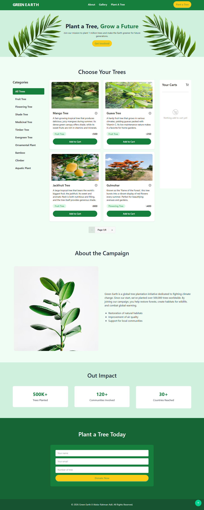
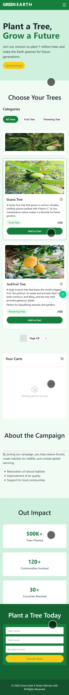

<div align="center">


# 🌿 Green Earth

### *Plant a Tree, Grow a Future*

A modern tree-planting campaign platform where users can browse, select, and donate trees to help restore our planet — one tree at a time.

# 📸 Screenshots

> 🖼️ Add your screenshots in `/public/screenshots/` and update paths below

| Desktop View | Mobile View |
|---|---|
|  |  |

---


</div>

---

## ✨ Features

- 🌳 **Browse Trees by Category** — Filter trees by type (Fruit, Shade, Flowering, etc.)
- 🛒 **Cart System** — Add multiple trees and track your total donation
- 📖 **About the Campaign** — Learn the mission and environmental impact
- 📊 **Impact Stats** — 500K+ trees planted, 120+ communities, 30+ countries
- 📬 **Plant a Tree Form** — Submit your details to contribute directly
- 📱 **Fully Responsive** — Mobile, tablet & desktop friendly
- ⚡ **Smooth Animations** — Powered by Framer Motion

---

## 🛠️ Tech Stack

| Technology | Purpose |
|---|---|
| ⚛️ React 19 | UI Library |
| ⚡ Vite | Build Tool |
| 🎨 Tailwind CSS | Styling |
| 🎞️ Framer Motion | Animations |
| 🌐 React Router DOM | Navigation |

---

## 📁 Project Structure

```
green_earth/
├── public/
├── src/
│   ├── assets/
│   ├── components/
│   │   ├── Navbar.jsx
│   │   ├── Hero.jsx
│   │   ├── TreeShop.jsx
│   │   ├── AboutCampaign.jsx
│   │   ├── Impact.jsx
│   │   ├── PlantForm.jsx
│   │   ├── Footer.jsx
│   │   ├── Button.jsx
│   │   └── Wrapper.jsx
│   ├── App.jsx
│   └── main.jsx
├── index.html
├── vite.config.js
└── package.json
```

---

## 🚀 Getting Started

### Prerequisites

- Node.js `v18+`
- npm or yarn

### Installation

```bash
# 1. Clone the repository
git clone https://github.com/SyntaxAdil/green_earth.git

# 2. Navigate into the project
cd green_earth

# 3. Install dependencies
npm install

# 4. Start the development server
npm run dev
```

Open [http://localhost:5173](http://localhost:5173) in your browser.

### Build for Production

```bash
npm run build
```

---

## 🌐 Pages & Sections

| Section | Description |
|---|---|
| 🏠 **Hero** | Banner with campaign tagline & CTA |
| 🌳 **Choose Your Trees** | Tree grid with categories & cart |
| 📖 **About the Campaign** | Mission, goals & campaign details |
| 📊 **Our Impact** | Key statistics & milestones |
| 📬 **Plant a Tree Today** | Donation/signup form |

---

## 🎨 Color Palette

| Color | Hex | Usage |
|---|---|---|
| 🟢 Primary Green | `#15803d` | Navbar, buttons, accents |
| 🌱 Light Green | `#e8f5e9` | Page background |
| 🍋 Yellow | `#facc15` | CTA buttons |
| 🌿 Dark Green | `#14532d` | Text headings |

---


---

## 🤝 Contributing

Contributions are welcome! Feel free to open an issue or submit a pull request.

```bash
# Fork → Clone → Create branch → Commit → Push → PR
git checkout -b feature/your-feature-name
```

---

## 📄 License

This project is open source and available under the [MIT License](LICENSE).

---

<div align="center">

Made with 💚 by **[SyntaxAdil](https://github.com/SyntaxAdil)** — Abdur Rahman Adil


*🌍 Every tree counts. Let's grow a greener future together.*

</div>